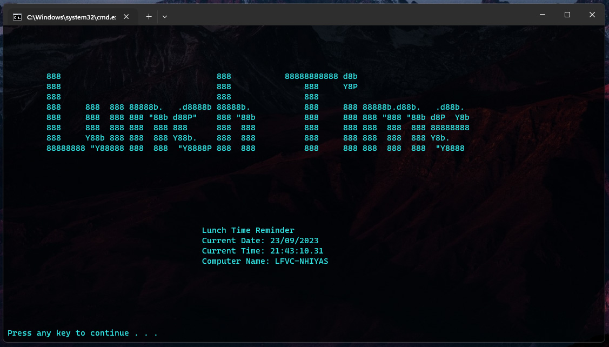

## Lunch Time Reminder

<p allign="center"></p>

This simple batch script allows you to remind lunch time on your working hours.

## How to Install

* Download all files and run as administrator the `Install.cmd`.
* The `import-task.cmd` file allows you to make a Windows Task Scheduler automatically on your desired specific time.
  To change specific time, you must open the `Lunch Time.xml` from any text editor and edit the time thru the lines below;
  the default time is `12:30:00`, and the default days are `Monday to Saturday`.
  
  ```ini
    <Triggers>
    <CalendarTrigger>
      <StartBoundary>2023-09-15T12:30:00</StartBoundary>
      <Enabled>true</Enabled>
      <ScheduleByWeek>
        <DaysOfWeek>
          <Monday />
          <Tuesday />
          <Wednesday />
          <Thursday />
          <Friday />
          <Saturday />
        </DaysOfWeek>
        <WeeksInterval>1</WeeksInterval>
      </ScheduleByWeek>
    </CalendarTrigger>
  </Triggers>
  ```

* After configuring the `Lunch Time.xml` file, run the `import-task.cmd` as administrator.
* `Lunch Time.xml` file is a configuration file for Task Scheduler.
* If you encounter any issues, you can manualy import the `Lunch Time.xml` file by clicking the `/Task Scheduler shortcut/Task Scheduler.lnk`.
  
